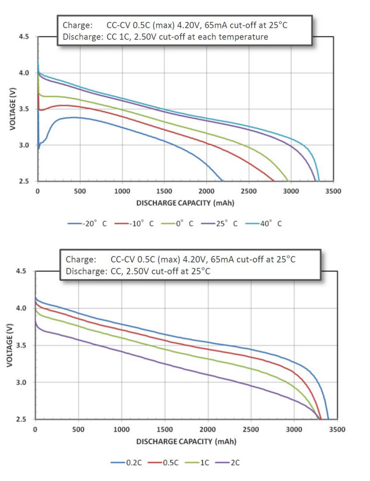

# Battery Discharge Calculator

Author: Stefan Damkjar

Date: 19-May-2023

## Description:
This project provides functions to estimate the battery discharge characteristics for the given discharge rate and temperature by applying interpolation techniques to the discharge curves in Figure 1. It can calculate the net change in energy stored in the battery given the discharge rate, temperature, initial voltage, and final voltage. The function to calculate the net change in energy stored can handle different battery pack configurations (e.g., "2s2p").

Tool to estimate the battery discharge characteristics for the given discharge rate and temperature by using interpolation techniques to the discharge curves in Figure 1. It can calculate the net change in energy stored in the battery given the discharge rate, temperature, initial voltage, and final voltage. The function to calculate the net change in energy stored can handle different battery pack configurations (e.g., "2s2p").

<div style="text-align:center"></div>
<div style="text-align:center"><font color="grey"><i>Figure. 1: Battery discharge curves from the NanoAvionics Battery Pack Datasheet</i></font></div><p></p>

## Usage:
1. Make sure the files are present in your working directory in matlab.
2. Call the functions from your MATLAB script or command window by providing the required inputs.

## Files:
- `interpolate_discharge_curve.m`: Interpolates the discharge curve based on the discharge rate and temperature.
- `calculate_energy_change.m`: Calculates the net change in energy stored in a battery based on the discharge rate, temperature, initial voltage, final voltage, and battery pack configuration.
- `dischargeCurves.mat`: Contains the data for the available discharge curves, extracted from the NanoAvionics Battery Pack datasheet.

## Interpolate Discharge Curve
Interpolates the discharge curve based on the discharge rate coefficient and temperature.

The `interpolate_discharge_curve` function takes the following inputs:

* `discharge_rate`: The desired discharge rate coefficient of the battery (0.2 to 2). A value of 2 indicates a discharge rate of 2C where C indicates the capacity of the battery divided by 1 hour. For example, for a battery with 3 Ah capacity, a discharge rate of 2C means the battery is supplying 6 A.
* `temperature`: The temperature at which the battery is discharged, specified in degrees Celsius (-20 degC to +40 degC).

The function uses interpolation techniques to estimate the discharge curve of the battery for the given discharge rate and temperature using the discharge curves stored in the dischargeCurves.mat file. It finds the two nearest discharge curves from the available data and performs linear interpolation to calculate the voltage for the specified discharge rate and temperature.

The output of the function is a structure that contains the interpolated discharge curve, including the discharged capacity (in mAh) and the corresponding voltage (in V).

### Example usage:
```matlab
discharge_rate = 1.5;               % Desired discharge rate
temperature = 10;                   % Desired temperature in degC

interpolated_curve = interpolate_discharge_curve(discharge_rate, temperature);

% Plot the interpolated discharge curve
plot(interpolated_curve.Discharged_Capacity_mAh, interpolated_curve.Voltage_V);
xlabel('Discharged Capacity (mAh)');
ylabel('Voltage (V)');
title('Interpolated Discharge Curve');
```

## Calculate Energy Change
Calculates the net change in energy stored in a battery based on the discharge rate, temperature, initial voltage, final voltage, and battery pack configuration.

The `calculate_energy_change` function takes the following inputs:

* `discharge_rate`: The desired discharge rate coefficient of the battery (0.2 to 2). A value of 2 indicates a discharge rate of 2C where C indicates the capacity of the battery divided by 1 hour. For example, for a battery with 3 Ah capacity, a discharge rate of 2C means the battery is supplying 6 A.
* `temperature`: The temperature at which the battery is discharged, specified in degrees Celsius (-20 degC to +40 degC).
* `initial_voltage`: The initial voltage of the battery (must be within the range of the discharge curves).
* `final_voltage`: The final voltage of the battery (must be within the range of the discharge curves).
* `pack_config`: (Optional) The configuration of the battery pack (e.g., "2s2p" for a 2-series 2-parallel configuration).

The function then uses the discharge rate and temperature to interpolate the discharge curve for the specific battery. It calculates the net change in energy stored in the battery by integrating the area under the interpolated discharge curve between the initial and final voltages. The function takes into account the battery pack configuration to determine the correct capacity for the calculations.

The output of the function is the net change in energy stored in the battery, in unit of watt-hours, which represents the difference in energy between the initial and final states of the battery after the specified discharge.

Note: The `interpolate_discharge_curve` function is used internally by `calculate_energy_change.m` to obtain the interpolated discharge curve for the given discharge rate and temperature.

### Example usage:
```matlab
discharge_rate = 1.5;               % Desired discharge rate
temperature = 10;                   % Desired temperature in degC
initial_voltage = 3.7;              % Initial voltage of the battery
final_voltage = 3.3;                % Final voltage of the battery
pack_config = '1s2p';               % Battery pack configuration

energy_change = calculate_energy_change(discharge_rate, temperature, initial_voltage, final_voltage, pack_config);
```
